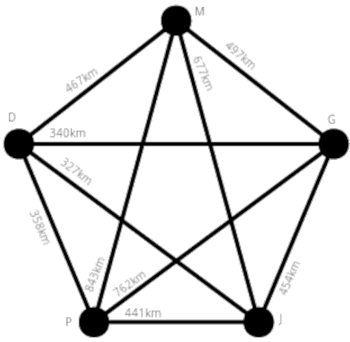
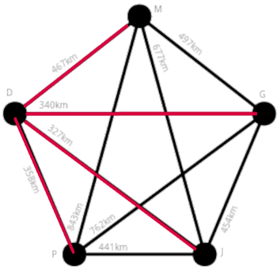
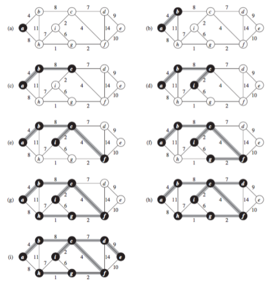
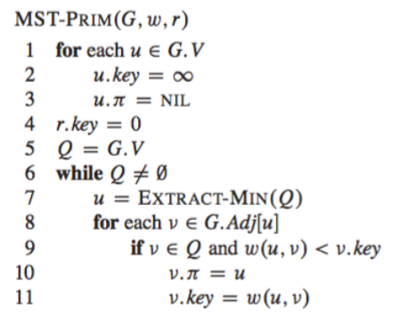

# Pesquisa Operacional II
## Otimização Inteira - Árvore Geradora Mínima

Prof. M.Sc. Diego Ascânio Santos (ascanio@cefetmg.br)

Aula baseada sobre o material do professor Dr. João Fernando Machry Sarubbi (joao@cefetmg.br - DECOM), vídeoaulas do curso de algoritmos de pesquisa operacional da Universidade Nacional de Taiwan e referências da documentação do Google OR-Tools

Belo Horizonte, 2023.

---

Roteiro

<ol>
  <li>Introdução</li>
  <li>Modelo em Programação Inteira</li>
  <li>Resolução via Solver (tempo exponencial)</li>
  <li>Resolução algoritmica (tempo logaritimico)</li> 
</ol>

---

<!-- _class: lead -->
# Introdução

---

Introdução

A empresa Ascânio Telecom deseja instalar links de fibra óptica para conectar as cidades de Divinópolis, Montes Claros, Governador Valadares, Juiz de Fora e Poços de Caldas.

 

---

Introdução

Seu objetivo como especialista em pesquisa operacional é o de utilizar a menor quantidade possível de cabos (para minimizar os custos) para formar uma rede de cabos entre as cinco cidades de forma que todas elas estejam interligadas sem cabos extras ou caminhos desnecessários.

 

---

Introdução

A árvore geradora mínima - por causa de seu formato de raízes / entroncamentos - é a estrutura que representa este conjunto de ligações entre cidades que conecta todas elas com o menor custo possível.

 

---

Então, podemos dizer que: Árvore geradora mínima é toda estrutura que liga cidades (nós) em uma região (grafo) através dos caminhos (arestas) de menor custo possível.

Sua aplicação na área de infraestrutura é bastante difundida, servindo para projetar redes de luz, água, telefone, esgoto, dentre outras.

---

# Modelo em Programação Linear Inteira

---

Modelo

O problema da árvore geradora mínima pode ser modelado por programação inteira.

De forma similar ao PCV\(^{ * }\), é necessário escolher caminhos que conectam cidades para formar uma ligação entre elas. Entretanto, enquanto no PCV a escolha dos caminhos deve formar um ciclo que começa e termina na mesma cidade, na árvora geradora mínima isto não pode ocorrer. 

Assim, as variáveis de decisão do problema são variáveis binárias da forma \( X_{ij} \in \{0, 1\} \) que representam a escolha (1) ou não escolha (0) de um caminho que liga a cidade \(i\) à cidade \(j\) para fazer parte da árvore geradora mínima.

---

Modelo

<ul>
    <li>A variável de decisão do problema é \(X_{ij} \in \{0, 1\}\) </li>
    <li>Todo caminho que liga uma cidade \(i\) à uma cidade \(j\) tem uma distancia \(D_{ij}\).</li>
    <li>Para conectar \(n\) cidades em uma árvore geradora mínima não podem existir nem mais, nem menos do que \(n - 1\) caminhos.</li>
    <li>Na árvore geradora mínima não são admitidos nenhum tipo de ciclo, ou seja, nenhuma cidade possui mais do que um caminho de entrada e um de saída.</li>
</ul>

---

Modelo

Logo, nosso objetivo é minimizar a distância total de cabos a conectarem as cidades, representado pela função:

\[ Z = \text{min} (\sum_{i = 1}^{n}{\sum_{j = 1}^{n}{D_{ij} \cdot X_{ij}}}) \]

Temos a restrição de que para conectar \(n\) cidades em uma árvore geradora mínima não podem existir nem mais, nem menos do que \(n - 1\) caminhos:

\[ \sum_{i=1}^{n}{\sum_{j=1}^{n}{X_{ij}}} = n - 1 \]

---

Modelo

Temos a nossa segunda restrição, que especifica que para todo e qualquer subconjunto \(S\) possível de cidades - exceto o conjunto vazio e o próprio conjunto \( V \) de cidades - este subconjunto deve possuir no máximo \(|S|^{ * }\) - 1 caminhos possíveis:

\[ \sum_{i, j \in S}{X_{ij}} \leq |S| - 1 \text{    } \forall S \subseteq V, \text{    } S \neq \emptyset \text{ e } S \neq V \]

Logo esta restrição desdobra-se em \(2^n\) restrições possíveis para todo \(S \subseteq V\).

---

Modelo

Considerando nosso conjunto de cidades \(\{D, M, G, J, P\}\) 

Seus subconjuntos possíveis: \(\{\}, \{D\}, \{M\}, \cdots, \{D, M, G\}, \cdots \{D, M, G, J, P\}\)

Para cada subconjunto \(S \in P\) (conjunto de partes, ou powerset), devemos adicionar uma restrição no nosso modelo.

Exemplo: \(S = \{D, M, G\}\). \(|S| = 3\)

Conjunto de caminhos de \(S\): \(\{X_{00}, X_{01}, X_{02}, X_{10}, X_{11}, X_{12}, X_{20}, X_{21}, X_{22}\}\)

Logo, adiciona-se a restrição: \(\sum_{i, j \in S}{X_{ij} \leq 3 - 1}\)

Faça isso para cada um dos outros subconjuntos possíveis de V

---

Modelo Final

$$
\begin{align*}
\text{Min Z} = &\sum_{i = 1}^{n}{\sum_{j = 1}^{n}{D_{ij} \cdot X_{ij}}} \\
\text{subject to} \\
               &\sum_{i=1}^{n}{\sum_{j=1}^{n}{X_{ij}}} = n - 1 \\
               &\sum_{i, j \in S}{X_{ij}} \leq |S| - 1 \text{    } \forall S \subseteq V, \text{    } S \neq \emptyset \text{ e } S \neq V \\
               &x_{ij} \in \{0, 1\} \text{ } \forall i = 1, \cdots, n; \text{ } \forall j = 1, \cdots, n
\end{align*}
$$

---
<!-- _class: lead -->
# Resolução

---

<iframe src="http://localhost:8888/notebooks/MST-IP.ipynb" width=100% height=100% ></iframe>

---

Resolução via Solver

O aspecto negativo da Resolução via Solver é seu tempo exponencial, pois, é necessário adicionar \(2^n\) restrições para impedir formações de ciclos.

Por isso, será abordado na sequência um algoritmo capaz de resolver o problema da árvore geradora mínima em tempo logaritimico, o algoritmo de Prim.

---

<!-- _class: lead -->
# Algoritmo de Prim

---

Algoritmo de Prim

O algoritmo de prim é um algoritmo com custo logaritimico usado para encontrar uma árvore geradora mínima em um mapa (grafo) de cidades e seus caminhos.

É possível esquematizar o algoritmo em quatro passos, como veremos a seguir:

---

Algoritmo de Prim

<ol>
    <li>Crie um conjunto de cidades visitadas, visite uma cidade qualquer do mapa e adicione esta cidade ao conjunto.</li>
    <li>Verifique todos os caminhos que saem do conjunto de cidades visitadas e visite a cidade (não visitada) mais próxima.</li>
    <li>Adicione esta cidade (e seu caminho) ao conjunto de cidades visitadas.</li>
    <li>Repita os passos 2 e 3 até que todas as cidades do mapa tenham sido visitadas.</li>
</ol>
O conjunto de caminhos representa a árvore geradora mínima!

---

---

Pseudo Código - Algoritmo de Prim

    

---

Resolução Árvore Geradora Mínima SciPy

<iframe src="http://localhost:8888/notebooks/MST-SCIPY.ipynb" width=1000px height=450px ></iframe>

